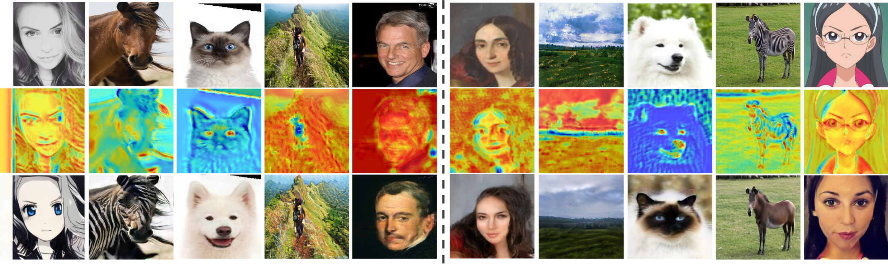
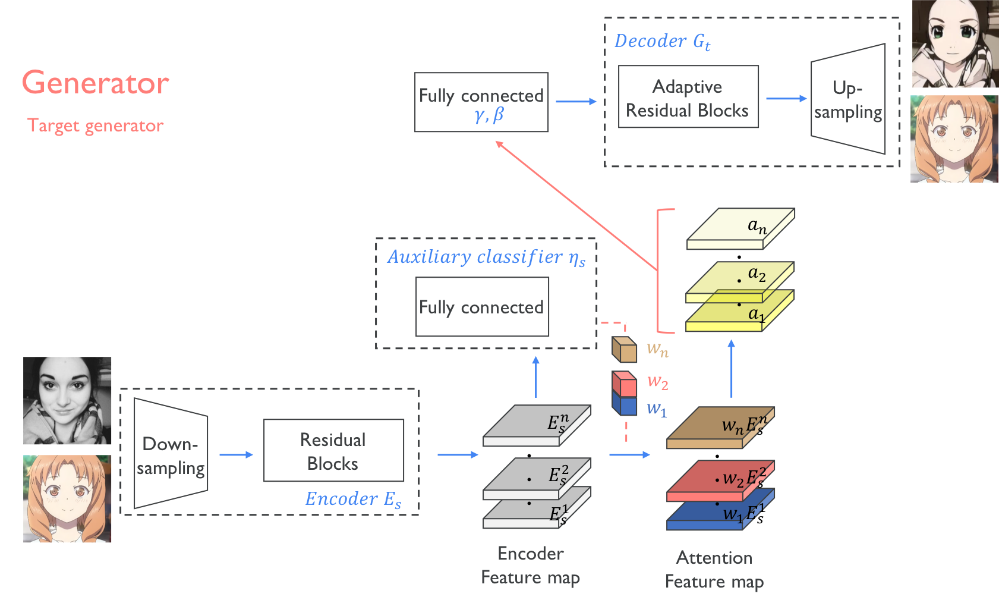
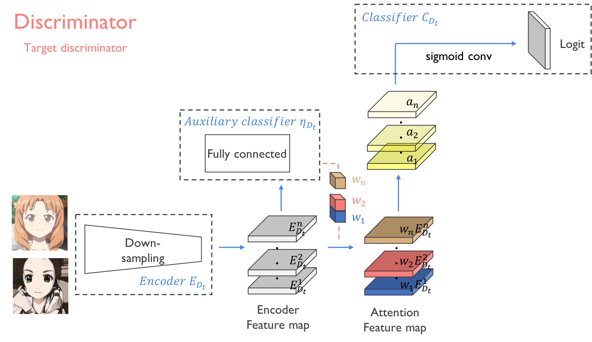
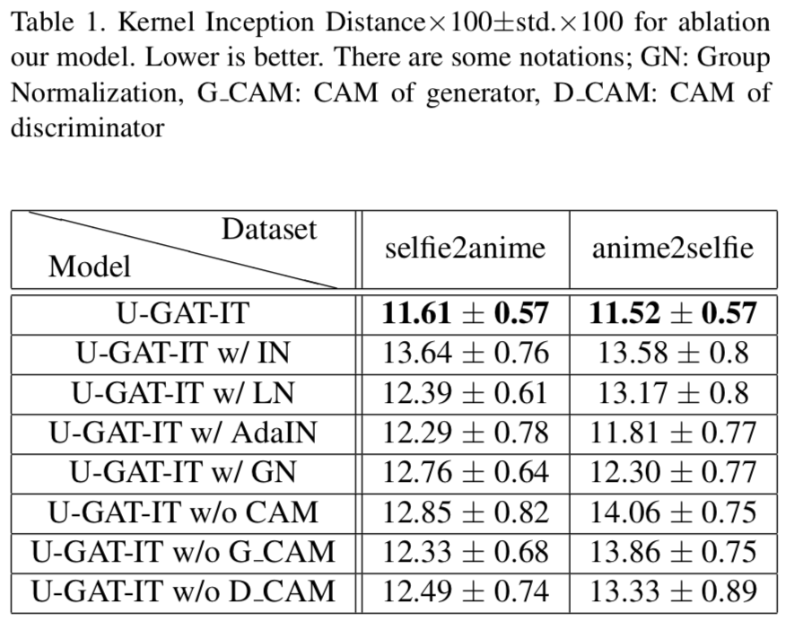
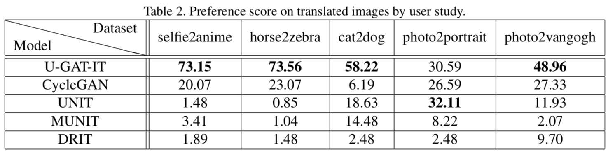
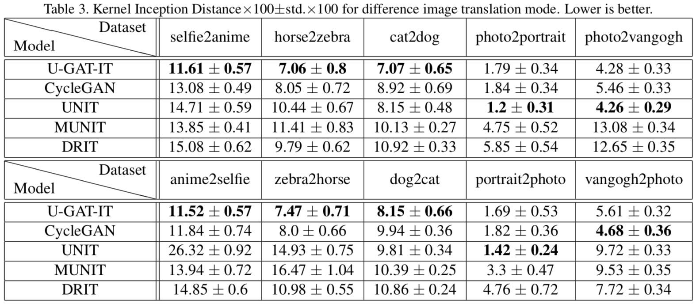

## U-GAT-IT &mdash; Official TensorFlow Implementation
### : Unsupervised Generative Attentional Networks with Adaptive Layer-Instance Normalization for Image-to-Image Translation

<div align="center">
  
</div>

### [Paper](https://arxiv.org/abs/1907.10830) | [Official Pytorch code](https://github.com/znxlwm/UGATIT-pytorch)

The results of the paper came from the **Tensorflow code**

> **U-GAT-IT: Unsupervised Generative Attentional Networks with Adaptive Layer-Instance Normalization for Image-to-Image Translation**<br>
> **Junho Kim (NCSOFT)**, Minjae Kim (NCSOFT), Hyeonwoo Kang (NCSOFT), Kwanghee Lee (Boeing Korea)
>
> **Abstract** *We propose a novel method for unsupervised image-to-image translation, which incorporates a new attention module and a new learnable normalization function in an end-to-end manner. The attention module guides our model to focus on more important regions distinguishing between source and target domains based on the attention map obtained by the auxiliary classifier. Unlike previous attention-based methods which cannot handle the geometric changes between domains, our model can translate both images requiring holistic changes and images requiring large shape changes. Moreover, our new AdaLIN (Adaptive Layer-Instance Normalization) function helps our attention-guided model to flexibly control the amount of change in shape and texture by learned parameters depending on datasets. Experimental results show the superiority of the proposed method compared to the existing state-of-the-art models with a fixed network architecture and hyper-parameters.*

## Pretrained model
> We released 50 epoch and 100 epoch checkpoints so that people could test more widely.
* [selfie2anime checkpoint (50 epoch)](https://drive.google.com/file/d/1V6GbSItG3HZKv3quYs7AP0rr1kOCT3QO/view?usp=sharing)
* [selfie2anime checkpoint (100 epoch)](https://drive.google.com/file/d/19xQK2onIy-3S5W5K-XIh85pAg_RNvBVf/view?usp=sharing)

## Dataset
* [selfie2anime dataset](https://drive.google.com/file/d/1xOWj1UVgp6NKMT3HbPhBbtq2A4EDkghF/view?usp=sharing)

## Web page
* [Selfie2Anime](https://selfie2anime.com) by [Nathan Glover](https://github.com/t04glovern)
* [Selfie2Waifu](https://waifu.lofiu.com) by [creke](https://github.com/creke)

## Usage
```
├── dataset
   └── YOUR_DATASET_NAME
       ├── trainA
           ├── xxx.jpg (name, format doesn't matter)
           ├── yyy.png
           └── ...
       ├── trainB
           ├── zzz.jpg
           ├── www.png
           └── ...
       ├── testA
           ├── aaa.jpg 
           ├── bbb.png
           └── ...
       └── testB
           ├── ccc.jpg 
           ├── ddd.png
           └── ...
```

### Train
```
> python main.py --dataset selfie2anime
```
* If the memory of gpu is **not sufficient**, set `--light` to **True**
  * But it may **not** perform well
  * paper version is `--light` to **False**

### Test
```
> python main.py --dataset selfie2anime --phase test
```

## Architecture
<div align="center">
  
</div>

---

<div align="center">
  
</div>

## Results
### Ablation study
<div align="center">
  
</div>

### User study
<div align="center">
  
</div>

### Kernel Inception Distance (KID)
<div align="center">
  
</div>

## Citation
If you find this code useful for your research, please cite our paper:

```
@article{kim2019u,
  title={U-GAT-IT: Unsupervised Generative Attentional Networks with Adaptive Layer-Instance Normalization for Image-to-Image Translation},
  author={Kim, Junho and Kim, Minjae and Kang, Hyeonwoo and Lee, Kwanghee},
  journal={arXiv preprint arXiv:1907.10830},
  year={2019}
}
```

## Author
[Junho Kim](http://bit.ly/jhkim_ai), Minjae Kim, Hyeonwoo Kang, Kwanghee Lee
